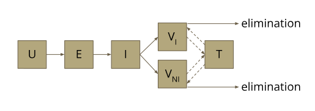
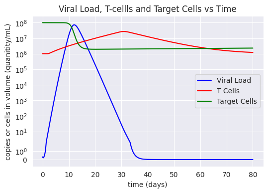
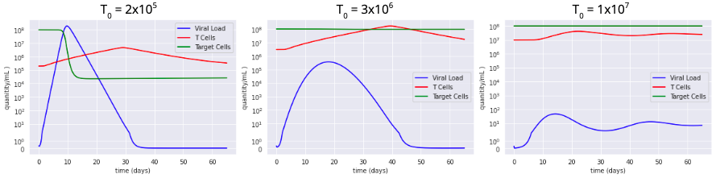

#  COVID-19: Modeling In-Host Viral and Innate Immune System Dynamics
### Kento Abeywardane, Adam Spooner, Benjamin Homer
#### Professor Srivasta
##### ENGN 2911R - Analytical Modeling for Biomechanical and Biomedical Systems
##### Brown University 

#
This was a final project that the above Brown University undergraduate students completed for the graduate-level class - _ENGN 2911R: Analytical Modeling for Biomechanical and Biomedical Systems_. A full report, presentation, and code are found in the files in this repository. 

## Project Overview
In this final project, the students created a novel model that describes the transience of viral load of COVID-19 after infection. The model involved developing a multicompartmental model often seen in infectious disease modeling and PKPD. It combined and improved upon two models found in the literature: [Hernandez-Vargas et al.](https://doi.org/10.1016/j.arcontrol.2020.09.006) and [Marc et al](https://elifesciences.org/articles/69302). The former focused on effect of T-cell immune response on viral load while the latter had specific compartments for categories of lung cells and virions. 

|  |
|:--:|
| _Figure 1: A generalized compartmental model of the novel system._ |

## Results
|  |
|:--:|
| _Figure 2: A comparison of the viral load, T-cell population, and target cells from the moment of infection using the novel model._ |

The model shows that there is a viral load peak at about 10 days after infection which could inform policy makers that people are most infectious 5 to 13 days after infection (assuming viral load and infectiousness are correlated linearly). T-cell counts peak at about 30 days and decreases  back to its intial size after about 60 days after initial infection. This suggests that reinfection is possible after 2 months. However, an analysis of the effect of increasing initial T-cell counts demonstrated a significant decrease in max viral load. This validates the importance of vaccines in order to decrease the severeness of COVID-19 in individual patients and perhaps even reduce infectiousness. 

|  |
|:--:|
|_Figure 3: Increasing initial T-cell count from left to right. Increased concentration of T cells is shown to reduce the viral load in the system more quickly and effectively._|

Some limitations that should be noted are that this model has not been directly validated to clinical data, but rather to several models produced by literature available at the time. These other models were validated against clinical data, and often obtained their parameters from best-fits. 

## Skills Utilized
- Literature review and analysis
- Parameter collection, fitting, and validation
- Systems of ODEs 
- Infectious Disease Modeling
- Compartmental models
- Numerical computing in Python in Jupyter Notebook envrionment (Numpy, SciPy)

## Class Overview
The class focused on four main topics:

1.  Experimental statistical analysis
    - Factorial Design of Experiments
    - ANOVA
2.  Infectious Disease Modeling
    - SIR, SEIR, SIRD, etc
3.  Biomechanics
    - Linear viscoelasticity
    - spring/dashpot models, analysis, and numerical computation
4.  Drug Delivery
    - Basic pharmacokinetics (1st order kinetics)
    - Diffusion
    - Higuchi Model

These topics were taught during lecture and reinforced with homeworks, literature reviews, and presentations.